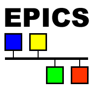
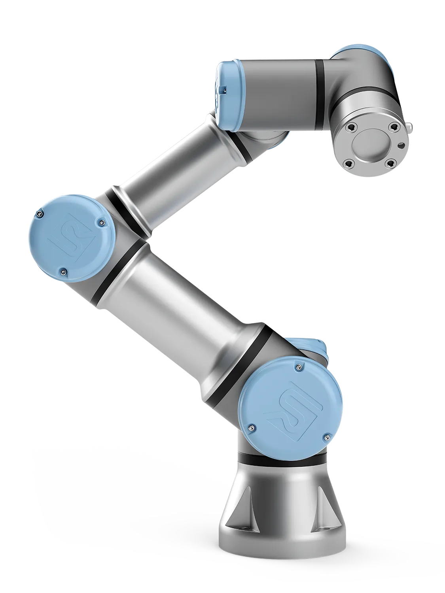

# EPICS urRobot

This support module provides an EPICS interface to control a Universal
Robots e-series robot arm. It works by mapping function calls in the
[ur_rtde](https://gitlab.com/sdurobotics/ur_rtde) library to EPICS PVs through asyn parameters.

## Key Features
- Access to large number of UR robot commands and status information
- Control individual joints and end-effector position
- Define joint or Cartesian space waypoints wtih associated waypoint actions in EPICS PVs
- Define paths to move through a series of waypoints
- GUIs in CSS-Phoebus, MEDM, and caQtDM

## Interfaces
The primary method for controlling Universal Robots remotely is through connecting a TCP client
to various servers hosted by the robot's controller. The `ur_rtde` library breaks up functionality
into four specific clients, or *interfaces*. For maximum flexibility, each interface in the
`ur_rtde` library can be loaded separately and each accepts multiple connections,
except the RTDE Control interface which only support a single connection.

For more details on how to add the EPICS UR Robot support to an IOC, see [Quickstart]({{ site.baseurl }}/quickstart.html).

### Dashboard Interface

The dashboard interface provides basic functionality for interacting with the robot such as:
- Loading, playing, pausing, and stopping URP programs that are saved in the controller
- Turning the robot and controller power on/off
- Releasing the breaks, closing popups, and restarting the safety configuration
- Basic status information such as the robot's mode, runtime state, and safety status

### RTDE Receive Interface

The RTDE Receive Interface provides in-depth status information on the robot including:
- Runtime state and safety mode
- Joint positions, velocities, accelerations, moments, temperatures, currents, and voltages
- Tool center point (TCP) pose, speed, and force
- Tool accelerometer reading
- Momentum
- Main controller and robot voltages and currents
- Digital inputs and outputs
- Analog inputs and outputs

### RTDE Control Interface

The RTDE Control Interface provides functions for moving the robot including:
- Moving individual joints to specified angles
- Moving the end-effector a specified pose

### RTDE I/O Interface

The RTDE I/O interface provides functions for reading and writing to the digital and analog I/O pins on the robot
controller, as well as the ability to adjust the speed slider.

## Additional Features

### Waypoints
Cartesian (linear in tool space) and joint space waypoints in can be defined using the provided `waypointJ.db`
and `waypointL.db` databases. It is often most useful to load many waypoints using a substitutions file
and configure the waypoints later at runtime. An example substitutions file can be found
at `urRobotApp/iocsh/waypoints.substitutions`.

### Paths
Paths of waypoints can be defined using the provided `path.db` and `path_waypoint.db` databases. Like waypoints, it is
often useful to load several paths with a number of possible points using a substitutions file. An example can be found
at `urRobotApp/iocsh/paths.substitutions`.
