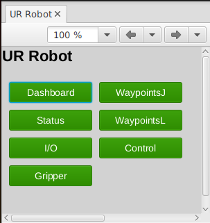
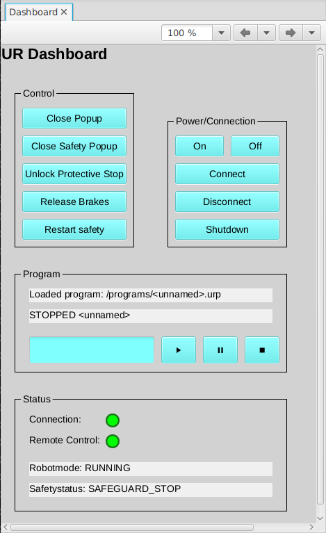
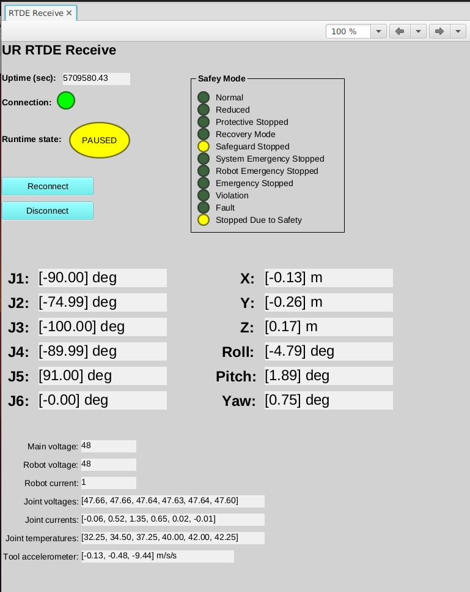
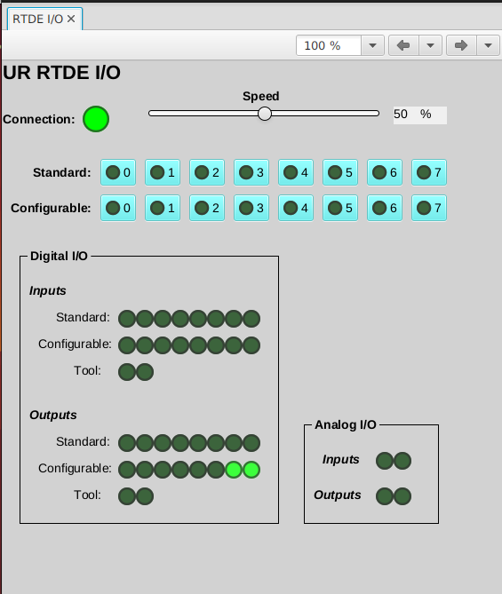
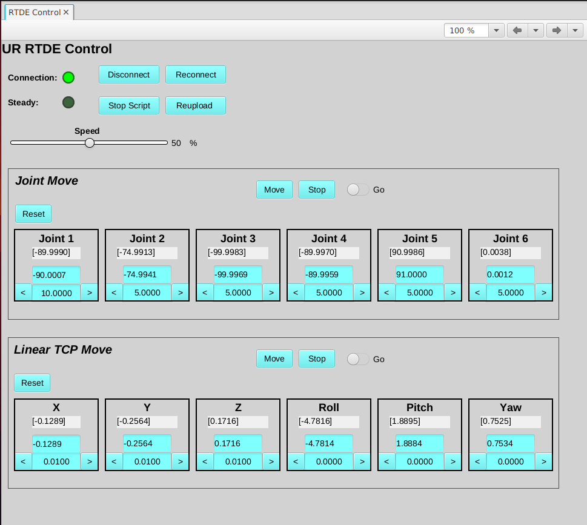
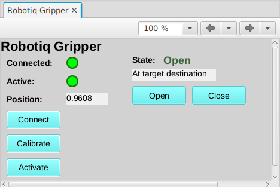
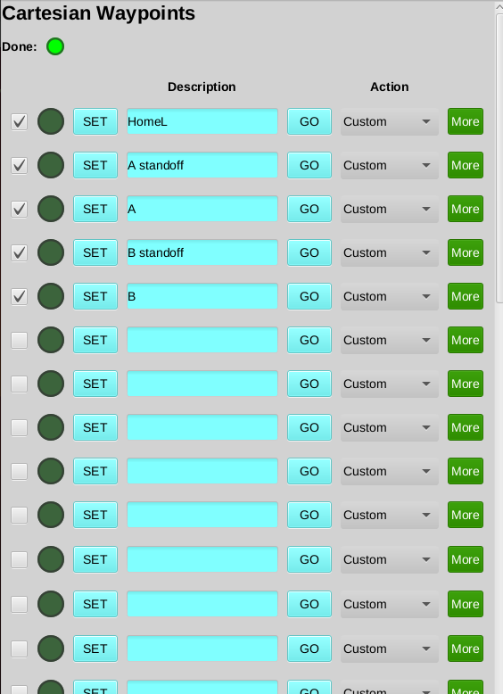
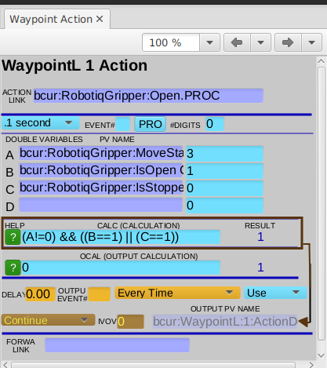

# Usage

## Table of contents
{: .no_toc .text-delta }

- TOC
{:toc}

If you haven't yet added the EPICS urRobot support to an IOC, please see
the Quickstart page for instructions.

Most of the basic functionality can be done through the provided GUIs using either
MEDM, caQtDM, or CSS-Phoebus. To start the screens, three bash scripts are
provided: `start_phoebus_urRobot` `start_MEDM_urRobot`, and `start_caQtdm_urRobot`

## CSS Phoebus GUIs

After running the `start_phoebus_urRobot` a script, the below screen will open.
The various buttons here will open the additional screens.

**Dashboard:**  

**RTDE Receive:**  

**RTDE I/O**  

**RTDE Control:**  

**Robotiq Gripper**  

**WaypointL**  

**Waypoint Action**  

## MEDM/caQtDM

MEDM screens are provided and can be started with provided `start_MEDM_urRobot` script. These screens have been
converted to caQtDM as well and those can be started with `start_caQTDM_urRobot`.

**TODO:** Add screenshots

