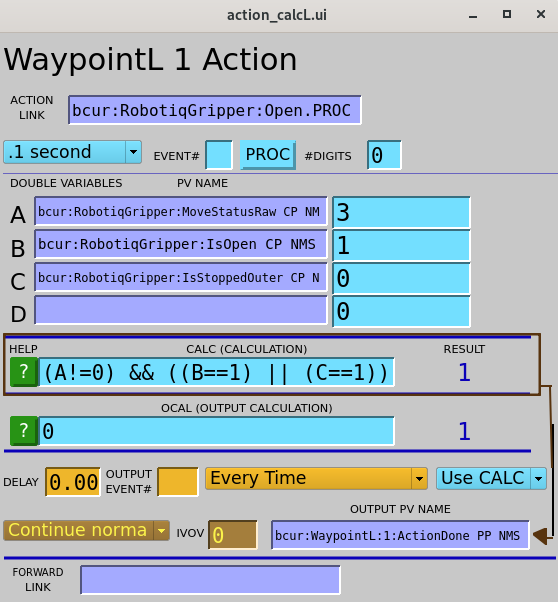

# Usage

## Table of contents
{: .no_toc .text-delta }

- TOC
{:toc}

If you haven't yet added the EPICS urRobot support to an IOC, please see
the Quickstart page for instructions.

Most features of the robot are accessable through the provided GUIs using either
MEDM, caQtDM, or CSS-Phoebus. To start the screens, three bash scripts are
provided: `start_phoebus_urRobot` `start_MEDM_urRobot`, and `start_caQtdm_urRobot`. Copy the script(s)
you want to the top level directory of your IOC. The below examples will show the caQtDM GUIs, however
the MEDM and CSS-Phoebus versions are nearly identical. Users are encourages to create their own GUIs
in addition to the ones provided for more specific needs.

## Main Menu

After running the `start_caQtDM_urRobot` script, you will be greeted with a menu which
contains links to all the other provided screens.


## UR Dashboard

The dashboard screen provides access to the most basic features of the robot like powering on/off,
and releasing brakes. It also allows a user to load and play URP programs that are saved in the robot controller.
The input for the URP filename ($(P)Dashboard:LoadURP) is the name of the URP file that is present in the `/programs`
directory on the robot controller.


## RTDE Receive

The RTDE Receive screen shows all the basic static information about the robot. The only interactive
element is the connect/disconnect buttons which allow for connecting and disconnecting to the RTDE
receive interface.


## RTDE I/O
The I/O screen allows for setting and reading digital and analog inputs and outputs on the robot controller.


## RTDE Control
The RTDE Control screen can be used to move the robot by directly commanding joint or end-effector positions.
It also has a button to enable/disable freedrive mode.


Although the GUI may look similar to typical EPICS motor screens, the robot's joint are *not* true EPICS motors.
The first thing to note is the "RESET" buttons, which write to the `$(P)Control:ResetJCmd` and `$(P)Control:ResetPoseCmd`
PVs respectively. When these PVs process they store the current measured values in the commanded values, similiar to
EPICS motor record behaivor after motion completes. Before tweaking joint or TCP values, clicking RESET is a good idea.

The "Go" toggles (which write to the `$(P)Control:AutoMoveJ` or `$(P)Control:AutoMoveL` PVs) are similar to the Go/Move
options in the EPICS motor record. For example, to move Joint 1 to -75deg, if "Go" is set to "No" (`$(P)Control:AutoMoveJ`=0),
then you must set Joint 1 to -75deg and click "Move" (`$(P)Control:moveJ`). If "Go" is set to "Yes" (`$(P)Control:AutoMoveJ`=1),
the robot will begin moving as soon as the commanded values change, so typing -75 in the box for Joint 1 and clicking enter will
start the robot moving. The same goes for the Cartesian moves.


## Robotiq Gripper

Currently the Robotiq Hand-E gripper is the only supported gripper.
The gripper screen has buttons for opening, closing, connecting, activating, and auto-calibrating.
It also shows the open/closed state, actual position, and motion status.


Although the auto-calibration works quite well, it requires the gripper to move through it's full range to determine
the correct open and closed positions, and must be re-calibrated each IOC restart. To avoid this, 
you can find the open and closed positions for your gripper and specify them when loading the gripper support
by passing the `MIN_POS` and `MAX_POS` macros to `robotiq_gripper.db`. Additionally the `AUTO_ACTIVATE` macro
can be set to YES (or NO) to automatically activate the gripper which must be done after a power cycle.

A command line tool for finding the min/max positions is provided with this EPICS support.
In the bin directory of the urRobot support (for example `urRobot/bin/rhel9-x86_64/`) you will find a `calibrate_gripper`
program. Running this with your robot's IP as argument will give you the min/max positions.
```bash
$ ./calibrate_gripper 164.54.100.100
Auto calibrating gripper...
Gripper calibrated

Min (closed) = 3
Max (open)   = 248
```
For my gripper, I found the minimum and maximum positions to be 3 and 248 respectively, so I loaded load `robotiq_gripper.db`
as follows:
```
dbLoadRecords("$(URROBOT)/db/robotiq_gripper.db", "P=$(PREFIX), MIN_POS=3, MAX_POS=248, AUTO_ACTIVATE=YES, PORT=asyn_gripper, ADDR=0")
```

## Waypoints

**TODO**





## Paths

**TODO**


## Scripting

It is often useful to program the robot by interacting with the available PVs in a script.
Below an example python script using [PyEpics](https://github.com/pyepics/pyepics) is provided which demonstrates how to move
joint 6 (wrist) +10deg, then -10deg back to where it started.


```python
from epics import caget, caput

PREFIX = "bcur:" # replace with your IOC prefix

def wait_motion():
    '''block execution until commanded motion finishes'''
    while True:
        if caget(f"{PREFIX}Control:Steady") == 0:
            break
    while True:
        if caget(f"{PREFIX}Control:Steady") == 1:
            break

# Disable auto move
# when enabled, changing commanded values will automatically move
# when disabled, you need to call moveJ to trigger the move
caput(f"{PREFIX}Control:AutoMoveJ", 0)

# Set commanded joint positions to current position
caput(f"{PREFIX}Control:ResetJCmd", 1)
# the above is the same as doing the following:
#  caput(f"{PREFIX}Control:J1Cmd", joint_angles[0])
#  caput(f"{PREFIX}Control:J2Cmd", joint_angles[1])
#  caput(f"{PREFIX}Control:J3Cmd", joint_angles[2])
#  caput(f"{PREFIX}Control:J4Cmd", joint_angles[3])
#  caput(f"{PREFIX}Control:J5Cmd", joint_angles[4])
#  caput(f"{PREFIX}Control:J6Cmd", joint_angles[5])

# Move J6 +20deg
print("Moving Joint 6 +10deg...")
joint_angles = caget(f"{PREFIX}Receive:ActualJointPositions")
caput(f"{PREFIX}Control:J6Cmd", joint_angles[5]+10)
caput(f"{PREFIX}Control:moveJ", 1)
wait_motion()

# Move J6 back to where it started
print("Moving Joint 6 -10deg...")
joint_angles = caget(f"{PREFIX}Receive:ActualJointPositions")
caput(f"{PREFIX}Control:J6Cmd", joint_angles[5]-10)
caput(f"{PREFIX}Control:moveJ", 1)
wait_motion()
print("Done!")
```
