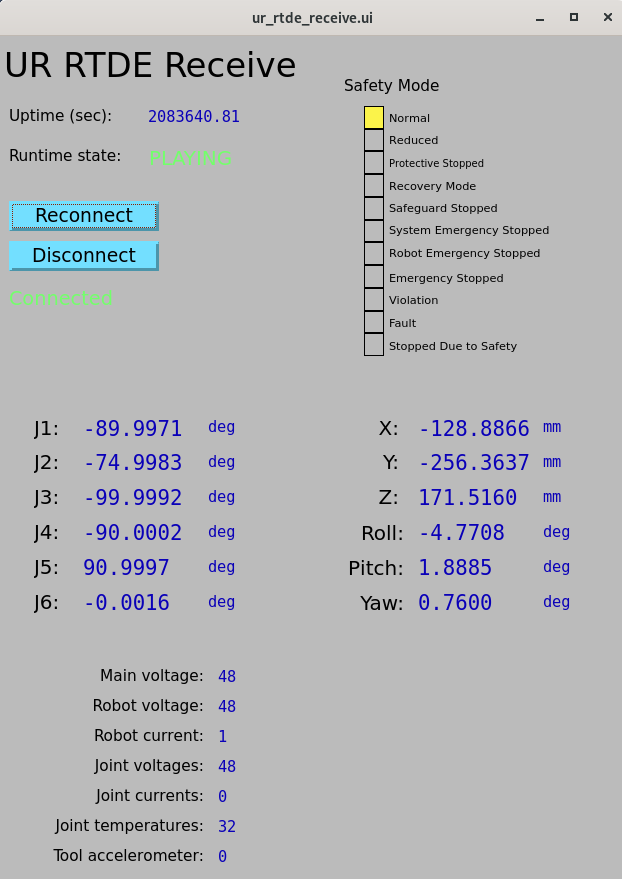
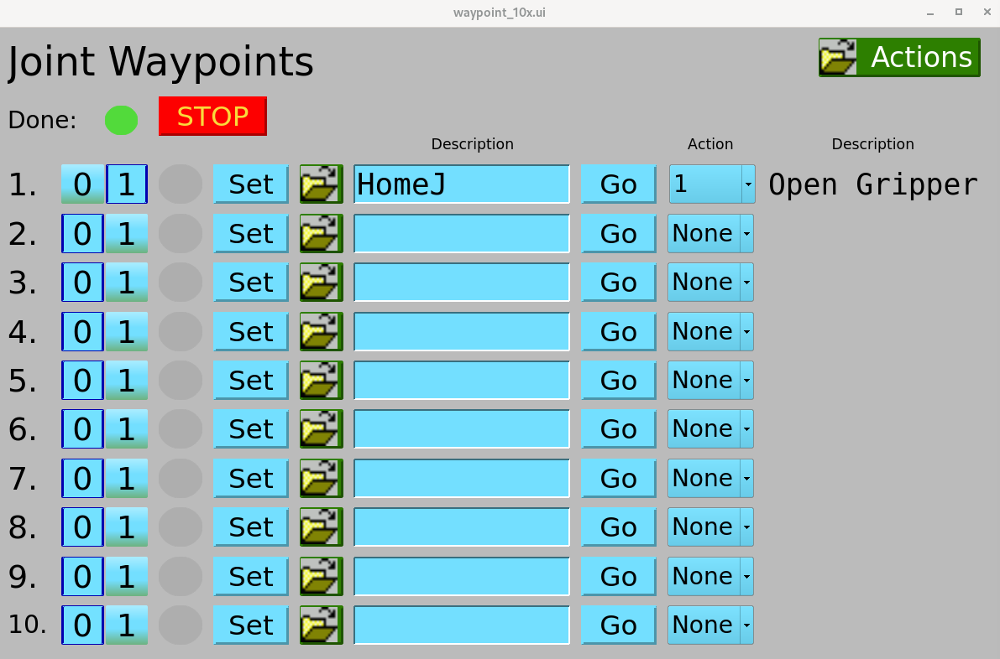
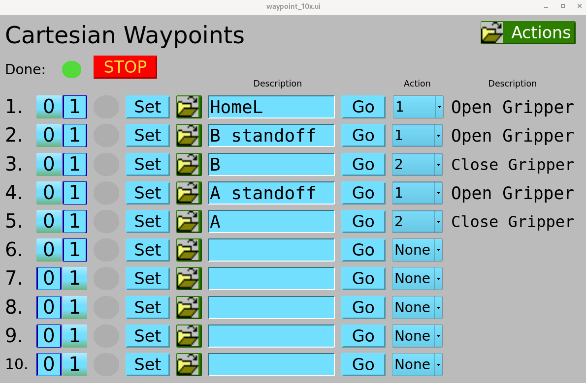
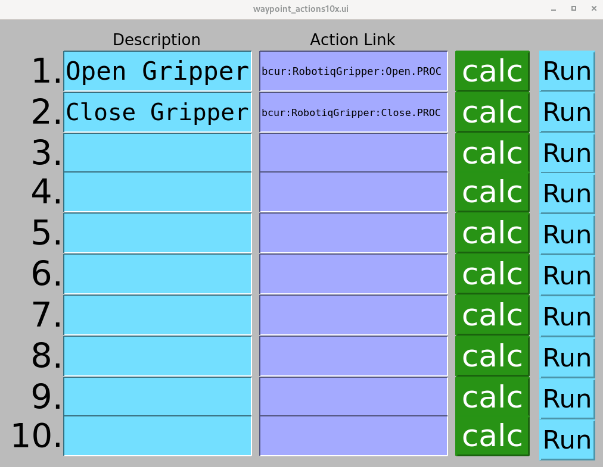

# Usage

## Table of contents
{: .no_toc .text-delta }

- TOC
{:toc}

If you haven't yet added the EPICS urRobot support to an IOC, please see
the Quickstart page for instructions. After starting an IOC with the urRobot support
included, you are ready to use your UR robot through EPICS.

Most features of the robot are accessable through the provided GUIs using either
MEDM, caQtDM, or CSS-Phoebus (still in development). To start the screens, a `start_urRobot` bash script is provided at
`urRobot/iocs/urExample/start_urRobot`. Copy the script to the top level directory of your IOC and run it without any
arguments to open the caQtDM screens, however optionally you can specify "medm" or "phoebus" as argument to the script
to use either of those display managers. The below examples will show the caQtDM GUIs, however the MEDM and CSS-Phoebus
versions are nearly identical. Users are encouraged to create their own GUIs in addition to the ones provided for more
specific needs.

## Logging
The UR robot EPICS driver uses [spdlog](https://github.com/gabime/spdlog) for logging. By default you will only see
log messages from the UR robot driver in the IOC console with "info", "warning", or "error" severity, however if you'd
like to see additional messages (with "debug" severity), you can set the "SPDLOG_LEVEL" environent variable before running
the IOC. The easiest way is to add the following command to your your .bashrc: `export SPDLOG_LEVEL=debug,mylogger=trace`. 


## Main Menu

After running the `start_urRobot` script, you will be greeted with a menu which
contains links to all the other provided screens.


## UR Dashboard

The dashboard screen provides access to the most basic features of the robot like powering on/off,
and releasing brakes. It also allows a user to load and play URP programs that are saved in the robot controller.
The input for the URP filename (`$(P)Dashboard:LoadURP`) is the name of the URP file that is present in the `/programs`
directory on the robot controller.


## RTDE Receive

The RTDE Receive screen shows all the basic status information about the robot. The only interactive
element is the connect/disconnect buttons which allow for connecting and disconnecting to the RTDE
receive interface.



## RTDE I/O
The I/O screen allows for setting and reading digital and analog inputs and outputs on the robot controller.


## RTDE Control
The RTDE Control screen can be used to move the robot by directly commanding joint or end-effector positions.
It also has a button to enable/disable teach (freedrive) mode.


Although the default control GUI may look similar to typical EPICS motor screens, the robot's joint are *not* true EPICS motors.
The x, y, z, roll, pitch, and yaw motors are virtual axes and moving them will move one or more joint motors. The joint motors
themselves are independent of each other, however motion of any joint motor will affect the position of the tool. To reconcile
this and reduce the likelyhood of accidentally commanding motion you didn't indend, every time motion completes, the command values
are automatically set to the current readback values, similar to an EPICS motor record. Since many EPICS users are accustomed to
the benefits of the motor record, a substitutions file is provided (urRobotApp/Db/ur_soft_motors.substitutions") which loads
12 soft motor records for the 6 joints and 6 tool coordinates. Additionally a version of the control GUI is provided for the soft
motors (urRobotApp/op/adl/ur_rtde_controlSM.adl).

The "Go" toggles (which write to the `$(P)Control:AutoMoveJ` or `$(P)Control:AutoMoveL` PVs) are similar to the Go/Move
options in the EPICS motor record. For example, to move Joint 1 to -75deg, if "Go" is set to "No" (`$(P)Control:AutoMoveJ`=0),
then you must set Joint 1 to -75deg and click "Move" (`$(P)Control:moveJ`). If "Go" is set to "Yes" (`$(P)Control:AutoMoveJ`=1),
the robot will begin moving as soon as the commanded values change, so typing -75 in the box for Joint 1 and clicking enter will
start the robot moving. The same goes for the Cartesian moves. Note that the "Move" buttons tell the robot to move to the current
joint or cartesian configuration defined by all 6 of the respective target values (J1Cmd, J2cmd... or PoseXCmd, PoseYCmd...).


## Robotiq Gripper

Currently the Robotiq Hand-E gripper is the only supported gripper in this EPICS module, howevever other grippers
and tools could still be made to work through waypoint actions which are discussed later.
The gripper screen has buttons for opening, closing, connecting, activating, and auto-calibrating.
It also shows the open/closed state, actual position, and motion status.


Although the auto-calibration works quite well, it requires the gripper to move through it's full range to determine
the correct open and closed positions, and must be re-calibrated each IOC restart. To avoid this, 
you can find the open and closed positions for your gripper and specify them when loading the gripper support
by passing the `MIN_POS` and `MAX_POS` macros to `robotiq_gripper.db`. Additionally the `AUTO_ACTIVATE` macro
can be set to YES (or NO) to automatically activate the gripper which must be done after a power cycle.

A command line tool for finding the min/max positions is provided with this EPICS support.
In the bin directory of the urRobot support (for example `urRobot/bin/rhel9-x86_64/`) you will find a `calibrate_gripper`
program. Running this with your robot's IP as argument will give you the min/max positions. Note that this will cause the gripper
to move through its full range of motion, so ensure there is nothing in the way of the gripper before running this program.
```bash
$ ./calibrate_gripper 164.54.100.100
Auto calibrating gripper...
Gripper calibrated

Min (closed) = 3
Max (open)   = 248
```
For my gripper, I found the minimum and maximum positions to be 3 and 248 respectively, so I load `robotiq_gripper.db`
as follows:
```
dbLoadRecords("$(URROBOT)/db/robotiq_gripper.db", "P=$(PREFIX), MIN_POS=3, MAX_POS=248, AUTO_ACTIVATE=YES, PORT=asyn_gripper, ADDR=0")
```

## Waypoints

Waypoints are configurations of the robot which can be defined in either joint space or end-effector
space (we also refer to the end-effector position by the tool center point, or TCP). Motion between points when using
`waypointL.db` is done linearly in Cartesian space, so you will also see these referred to as as "Cartesian" waypoints.

Although not currently supported, theoretically we could define waypoints in joint space, then execute linear motion
in Cartesian space to the waypoint, or conversely define a waypoint in Cartesian space and exectute linear
motion in joint space to the waypoint. For now though, executing a move to a joint waypoint (`waypointJ.db`) will
move linearly in joint space, and executing a move to a Cartesian waypoint (`waypointL.db`) will
move linearly in Cartesian (end-effector) space.

Two screens are provided for defining joint or Cartesian waypoints:

<div style="display: flex; justify-content: center; gap: 10px;">
  
  
</div>

A single waypoint is defined by an instance of `waypointL.db` or `waypointJ.db`. It is typically most useful to
load many waypoints in your IOC startup script with a subtitutions file (`urRobotApp/iocsh/waypoints.substitutions`),
then define them at runtime. `.req` files for autosave are provided in `urRobotApp/Db/`.
Looking at the above Cartesian Waypoint display, from left to right on each line you have the following:
- Waypoint number for quick reference (call it `$(N)`) which ranges from 1-10 in this example.
- Enable(ON)/Disable(OFF) toggle (`$(P)WaypointL:$(N):Enabled`)
- Indicator for when the waypoint is reached (`$(P)WaypointL:$(N):Reached`=1) or when the robot is en-route to the waypoint
(`$(P)WaypointL:$(N):Busy`=1). Green means the robot is at the waypoint, yellow means it is on the way to the waypoint,
otherwise it will be gray.
- "Set" button to save the current robot configuration to the waypoint (`$(P)WaypointL:$(N):Reset`)
- Related display to view and edit the waypoint coordinates and dynamics.
- A string description of the waypoint (`$(P)WaypointL:$(N)`)
- "Go" button to attempt to move the robot from the current configuration to the waypoint (`$(P)WaypointL:$(N):moveL`)
    - Before motion is attempted, the driver checks that the robot will remain within safety limits throughout the move.
    If the move will break the safety limits, it will not be attempted and a message saying so will be printed in the IOC console.
    The move will also not be started if another move is currently in progress.
- Waypoint action selection menu (`$(P)WaypointL:$(N):ActionOpt`) which is used to select the action to perform after
the robot reaches the waypoint. Waypoint actions are discussed in greater detail in the next section.
- String description of the selected waypoint action
- At the top of the display there is a indicator to signal when a motion is done (`$(P)Control:AsyncMoveDone`) and a stop
button to stop a move in progress.


### Waypoint Actions

Each waypoint has an associated action which is executed automatically after the robot reaches the waypoint.
Each action is defined by an EPICS forward link together with a calcout record that determines when
the action is done (1=done, 0=not done). There are 10 configurable waypoint actions which are
defined in `waypoint_actions10.db`. All ten actions can be overwritten, however the first two come
pre-configured for opening and closing the Robotiq gripper, which many users may find useful.

The below screen is used to configure the waypoint actions. Each waypoint action should
be given an EPICS link to process and optionally a string description of the action. Then, by selection the
green "calc" buttons, you can define the conditions under which the action is considered to be finished.




The "Run" button processes the action link. When developing a new custom waypoint action, to ensure the
calcout record properly determines when the action is completed, it is useful to use the "Run" button
and verify that the calcout record's value is 0 when the action is running, and 1 when it completes.
The calcout logic is crucial for motion along a path (discussed in the next section) since the value
of the calcout record is used to determine when to move on to the next point.

## Paths

After you have defined some waypoints, the provided path support allows you to define and save sequences
of waypoints for the robot to follow. Each path is comprised of a number of `path_waypoint.db` instances
and a `path.db` instance. It is useful to load several empty paths in your IOC startup script with a
subtitutions file. The example substitutions file  (`urRobotApp/iocsh/paths.substitutions`) loads 5 paths
with 30 possible waypoints each.

After selecting "Paths" from the main menu, you will get the topPaths5x screen:


From this screen you can give a string description of the path and execute and stop the path with the
"Go" and "Stop" buttons. If you select the green path number button on the left you will get the following
screen which lets you define the path:


Looking at the above screen for Path `$(N)` which we have named "A to B", each line (1-10 on this screen)
defines a waypoint along the path. This path in particular uses some predefined waypoints to create a pick
and place operation. From left to right, each line contains the following:
- Path point number for reference (`$(K)`)
- Enable(1)/Disable(0) toggle (`$(P)Path$(N):$(K):Enabled`)
- Indicator for when the waypoint is reached (`$(P)Path$(N):$(K):Reached`)
- Type of path waypoint (`$(P)Path$(N):$(K):Type`) which can either be Joint or Linear (for waypointJ or waypointL)
- Number of path waypoint (`$(P)Path$(N):$(K):Number`)
- Action override for path waypoint (`$(P)Path$(N):$(K):ActionOverride`)
    - The action override allows you to override the action defined for a waypoint. This is useful
    when you want to go to the same waypoint multiple times in a path but with different actions.
    After the path is complete, the original action that was defined for the waypoint will be restored.
- Description of the selection waypoint (`$(P)Path$(N):$(K):Desc`)
- Description of the selection waypoint action (`$(P)Path$(N):$(K):ActionDesc`).
    - Note that the waypoint description and waypoint action description will only update when any of the
    other fields change (type, number, override, etc.)
- "Go" and "Stop" buttons at the top which starts/stops motion along the path. The go button will tell the
robot will move to each waypoint, execute the waypoint action, then move to the next waypoint in the path.
The stop button will stop motion immediately and abort the path. This means that you must start the path from
the beginning if it has been stopped. There is no way to pause a path at this time.

Let's give a quick example. Say you have defined $(P)WaypointL:3 and you want to set the first
point in your path to be WaypointL:3 and to make sure that the gripper is open.
For point 1 in your path, you'd set the Type to "Linear", Number to 3, and Action Override to 1 (open gripper).


## Scripting

Some may find it useful to program the robot by interacting with the available PVs in a script.
Below an example Python script using [PyEpics](https://github.com/pyepics/pyepics) is provided which demonstrates how to move
joint 6 (wrist) +10deg, then -10deg back to where it started.


```python
from epics import caget, caput

PREFIX = "MyPrefix:" # replace with your IOC prefix

# quick hack to wait for motion to start and complete
def wait_motion():
    '''block execution until commanded motion finishes'''
    while True:
        if caget(f"{PREFIX}Control:Steady") == 0:
            break
    while True:
        if caget(f"{PREFIX}Control:Steady") == 1:
            break

# Disable auto move
# when enabled, changing commanded values will automatically move
# when disabled, you need to call moveJ to trigger the move
caput(f"{PREFIX}Control:AutoMoveJ", 0)

# Move J6 +10deg
print("Moving Joint 6 +10deg...")
joint_angles = caget(f"{PREFIX}Receive:ActualJointPositions")
caput(f"{PREFIX}Control:J6Cmd", joint_angles[5]+10)
caput(f"{PREFIX}Control:moveJ", 1)
wait_motion()

# Move J6 back to where it started
print("Moving Joint 6 -10deg...")
joint_angles = caget(f"{PREFIX}Receive:ActualJointPositions")
caput(f"{PREFIX}Control:J6Cmd", joint_angles[5]-10)
caput(f"{PREFIX}Control:moveJ", 1)
wait_motion()
print("Done!")
```
