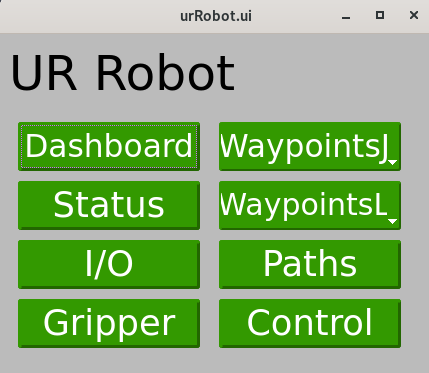
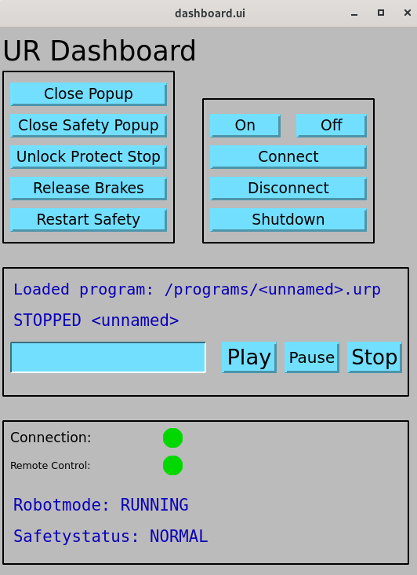
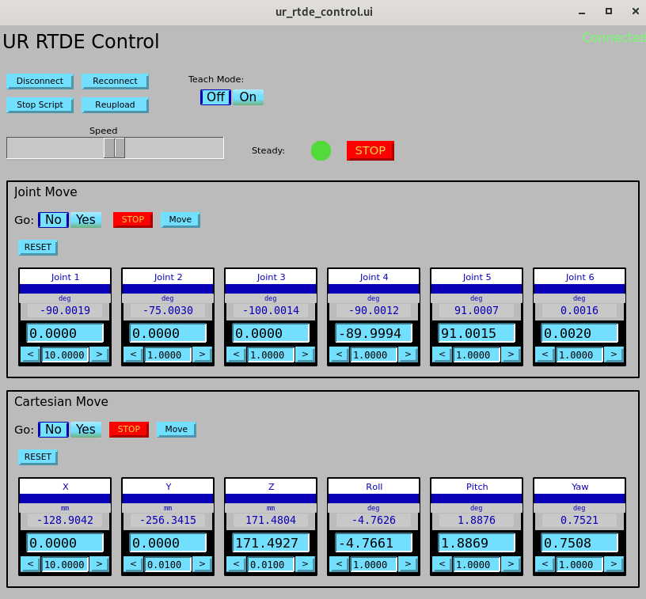
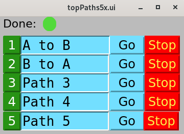
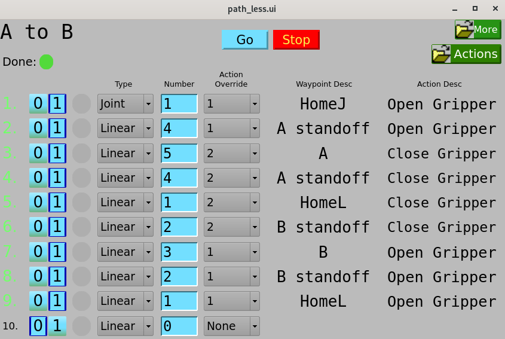

# Usage

## Table of contents
{: .no_toc .text-delta }

- TOC
{:toc}

If you haven't yet added the EPICS urRobot support to an IOC, please see
the Quickstart page for instructions.

Most features of the robot are accessable through the provided GUIs using either
MEDM, caQtDM, or CSS-Phoebus. To start the screens, three bash scripts are
provided: `start_phoebus_urRobot` `start_MEDM_urRobot`, and `start_caQtdm_urRobot`. Copy the script(s)
you want to the top level directory of your IOC. The below examples will show the caQtDM GUIs, however
the MEDM and CSS-Phoebus versions are nearly identical. Users are encouraged to create their own GUIs
in addition to the ones provided for more specific needs.

## Main Menu

After running the `start_caQtDM_urRobot` script, you will be greeted with a menu which
contains links to all the other provided screens.




## UR Dashboard

The dashboard screen provides access to the most basic features of the robot like powering on/off,
and releasing brakes. It also allows a user to load and play URP programs that are saved in the robot controller.
The input for the URP filename (`$(P)Dashboard:LoadURP`) is the name of the URP file that is present in the `/programs`
directory on the robot controller.




## RTDE Receive

The RTDE Receive screen shows all the basic static information about the robot. The only interactive
element is the connect/disconnect buttons which allow for connecting and disconnecting to the RTDE
receive interface.


## RTDE I/O
The I/O screen allows for setting and reading digital and analog inputs and outputs on the robot controller.


## RTDE Control
The RTDE Control screen can be used to move the robot by directly commanding joint or end-effector positions.
It also has a button to enable/disable freedrive mode.



Although the GUI may look similar to typical EPICS motor screens, the robot's joint are *not* true EPICS motors.
The first thing to note is the "RESET" buttons, which write to the `$(P)Control:ResetJCmd` and `$(P)Control:ResetPoseCmd`
PVs respectively. When these PVs process they store the current measured values in the commanded values, similiar to
EPICS motor record behaivor after motion completes. Before tweaking joint or TCP values, clicking RESET is a good idea.

The "Go" toggles (which write to the `$(P)Control:AutoMoveJ` or `$(P)Control:AutoMoveL` PVs) are similar to the Go/Move
options in the EPICS motor record. For example, to move Joint 1 to -75deg, if "Go" is set to "No" (`$(P)Control:AutoMoveJ`=0),
then you must set Joint 1 to -75deg and click "Move" (`$(P)Control:moveJ`). If "Go" is set to "Yes" (`$(P)Control:AutoMoveJ`=1),
the robot will begin moving as soon as the commanded values change, so typing -75 in the box for Joint 1 and clicking enter will
start the robot moving. The same goes for the Cartesian moves.


## Robotiq Gripper

Currently the Robotiq Hand-E gripper is the only supported gripper.
The gripper screen has buttons for opening, closing, connecting, activating, and auto-calibrating.
It also shows the open/closed state, actual position, and motion status.


Although the auto-calibration works quite well, it requires the gripper to move through it's full range to determine
the correct open and closed positions, and must be re-calibrated each IOC restart. To avoid this, 
you can find the open and closed positions for your gripper and specify them when loading the gripper support
by passing the `MIN_POS` and `MAX_POS` macros to `robotiq_gripper.db`. Additionally the `AUTO_ACTIVATE` macro
can be set to YES (or NO) to automatically activate the gripper which must be done after a power cycle.

A command line tool for finding the min/max positions is provided with this EPICS support.
In the bin directory of the urRobot support (for example `urRobot/bin/rhel9-x86_64/`) you will find a `calibrate_gripper`
program. Running this with your robot's IP as argument will give you the min/max positions.
```bash
$ ./calibrate_gripper 164.54.100.100
Auto calibrating gripper...
Gripper calibrated

Min (closed) = 3
Max (open)   = 248
```
For my gripper, I found the minimum and maximum positions to be 3 and 248 respectively, so I load `robotiq_gripper.db`
as follows:
```
dbLoadRecords("$(URROBOT)/db/robotiq_gripper.db", "P=$(PREFIX), MIN_POS=3, MAX_POS=248, AUTO_ACTIVATE=YES, PORT=asyn_gripper, ADDR=0")
```

## Waypoints

Waypoints are configurations of the robot which can be defined in either joint space or end-effector
space (also called the tool center point, or TCP). Two screens are provided for defining joint or
end-effector space waypoints:

<div style="display: flex; justify-content: center; gap: 10px;">
  
  
</div>

A single waypoint is defined by an instance of `waypointL.db` or `waypointJ.db`. It is typically most useful to
load many blank waypoints in your IOC startup script with a subtitutions file (`urRobotApp/iocsh/waypoints.substitutions`),
then define them at runtime. `.req` files for autosave are provided in `urRobotApp/Db/`.
Looking at the above Cartesian Waypoint display, from left to right on each line you have the following:
- Waypoint number for quick reference (call it `$(N)`) which ranges from 1-10 in this example.
- Enable(1)/Disable(0) toggle (`$(P)WaypointL:$(N):Enabled`)
- Indicator for when the waypoint is reached (`$(P)WaypointL:$(N):Reached`)
- "Set" button to save the current robot configuration to the waypoint (`$(P)WaypointL:$(N):Reset`)
- A string description of the waypoint (`$(P)WaypointL:$(N)`)
- "Go" button to attempt to move the robot from the current configuration to the waypoint (`$(P)WaypointL:$(N):moveL`)
    - Before motion is attempted, the driver checks that the robot will remain within safety limits throughout the move.
    If the move will break the safety limits, it will not be attempted and a message saying so will be printed in the IOC console.
- Waypoint action selection menu (`$(P)WaypointL:$(N):ActionOpt`) which is used to select the action to perform after
the robot reaches the waypoint. Waypoint actions are discussed in greater detail in the next section.
- Related display to view and edit the waypoint coordinates and dynamics as well as the waypoint action.
- At the top of the display there is a indicator to signal when a motion is done (`$(P)Control:AsyncMoveDone`) and a stop
button to stop a move in progress.


### Waypoint Actions

Each waypoint has an associated action which is executed automatically after the robot reaches a waypoint.
In software, the action is just another EPICS forward link (`$(P)WaypointL:$(N):Action.FLNK`) together with a
calcout record (`$(P)WaypointL:$(N):ActionDoneCalc`) that defines when the action is done.
For maximum flexibility, the action link and calcout record are left to the user to configure,
however two pre-configured actions are provided for opening the gripper and closing the gripper.


To create a new custom action, specify the PV you would like to process after reaching the
waypoint in the "Action Link" box (`$(P)WaypointL:$(N):Action.FLNK`). Then, fill out the calcout
record (`$(P)WaypointL:$(N):ActionDoneCalc`) such that its VAL=0 when the action is not complete and
VAL=1 when the action is done. See "Open Gripper" or "Close gripper" actions for an example.


## Paths

After you have defined some waypoints, the provided path support allows you to define and save sequences
of waypoints for the robot to follow. Each path is comprised of a number of `path_waypoint.db` instances
and a `path.db` instance. It is useful to load several empty paths in your IOC startup script with a
subtitutions file. The example substitutions file  (`urRobotApp/iocsh/paths.substitutions`) loads 5 paths
with 30 possible waypoints each.

After selecting "Paths" from the main menu, you will get the topPaths5x screen:



From this screen you can give a string description of the path and execute and stop the path with the
"Go" and "Stop" buttons. If you select the green path number button on the left you will get the following
screen which lets you define the path:



Looking at the above screen for Path `$(N)`, each line (1-10 on this screen) defines a waypoint along the path.
From left to right, each line contains the following:
- Path point number for reference (`$(K)`)
- Enable(1)/Disable(0) toggle (`$(P)Path$(N):$(K):Enabled`)
- Indicator for when the waypoint is reached (`$(P)Path$(N):$(K):Reached`)
- Type of path waypoint (`$(P)Path$(N):$(K):Type`) which can either be Joint or Linear (for waypointJ or waypointL)
- Number of path waypoint (`$(P)Path$(N):$(K):Number`)
- Action override for path waypoint (`$(P)Path$(N):$(K):ActionOverride`)
    - The action override allows you to override the action defined for a waypoint. This is useful
    when you want to go to the same waypoint multiple times in a path but with different actions.
    After the path is complete, the original action that was defined for the waypoint will be restored.
- Description of the selection waypoint (`$(P)Path$(N):$(K):Desc`)
- "Go" button at the top which starts motion along the path. The robot will move to each waypoint, execute the waypoint action,
then move to the next waypoint in the path. The stop button will stop motion immediately and abort the path. This means
that you must start the path from the beginning if it has been stopped. There is no way to pause a path at this time.

With the above in mind, let's give an example. Say you have defined $(P)WaypointL:3 and you want to set the first
point in your path to be WaypointL:3 and to make sure that the gripper is open.
For point 1 in your path, you'd set the Type to "Linear", Number to 3, and Action Override to "Open".


## Scripting

Some may find it useful to program the robot by interacting with the available PVs in a script.
Below an example Python script using [PyEpics](https://github.com/pyepics/pyepics) is provided which demonstrates how to move
joint 6 (wrist) +10deg, then -10deg back to where it started.


```python
from epics import caget, caput

PREFIX = "bcur:" # replace with your IOC prefix

def wait_motion():
    '''block execution until commanded motion finishes'''
    while True:
        if caget(f"{PREFIX}Control:Steady") == 0:
            break
    while True:
        if caget(f"{PREFIX}Control:Steady") == 1:
            break

# Disable auto move
# when enabled, changing commanded values will automatically move
# when disabled, you need to call moveJ to trigger the move
caput(f"{PREFIX}Control:AutoMoveJ", 0)

# Set commanded joint positions to current position
caput(f"{PREFIX}Control:ResetJCmd", 1)
# the above is the same as doing the following:
#  caput(f"{PREFIX}Control:J1Cmd", joint_angles[0])
#  caput(f"{PREFIX}Control:J2Cmd", joint_angles[1])
#  caput(f"{PREFIX}Control:J3Cmd", joint_angles[2])
#  caput(f"{PREFIX}Control:J4Cmd", joint_angles[3])
#  caput(f"{PREFIX}Control:J5Cmd", joint_angles[4])
#  caput(f"{PREFIX}Control:J6Cmd", joint_angles[5])

# Move J6 +20deg
print("Moving Joint 6 +10deg...")
joint_angles = caget(f"{PREFIX}Receive:ActualJointPositions")
caput(f"{PREFIX}Control:J6Cmd", joint_angles[5]+10)
caput(f"{PREFIX}Control:moveJ", 1)
wait_motion()

# Move J6 back to where it started
print("Moving Joint 6 -10deg...")
joint_angles = caget(f"{PREFIX}Receive:ActualJointPositions")
caput(f"{PREFIX}Control:J6Cmd", joint_angles[5]-10)
caput(f"{PREFIX}Control:moveJ", 1)
wait_motion()
print("Done!")
```
